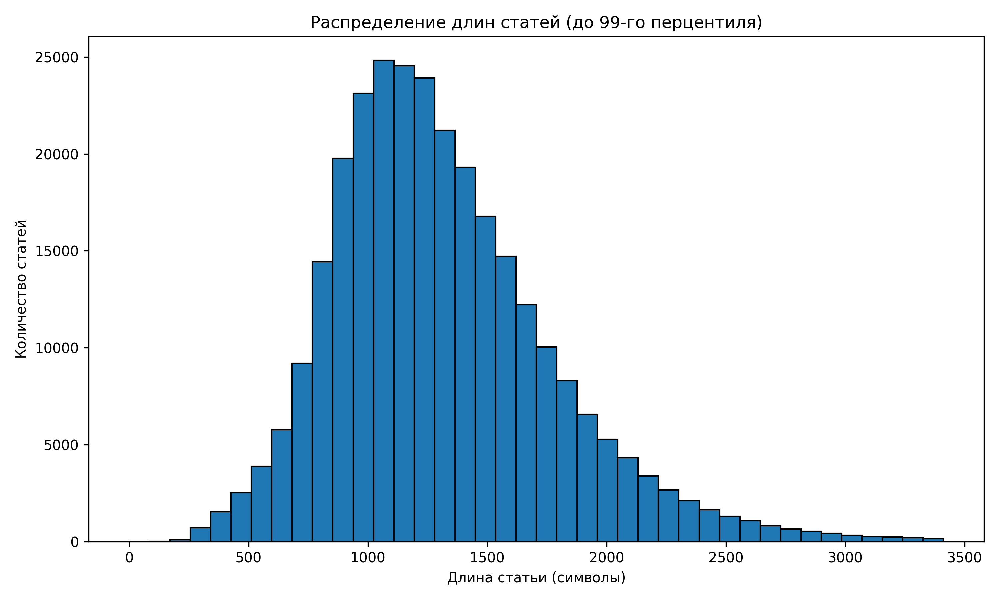
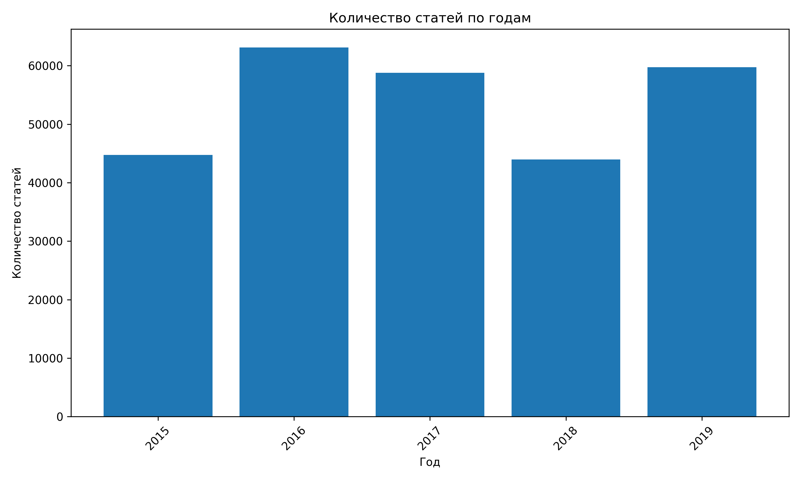
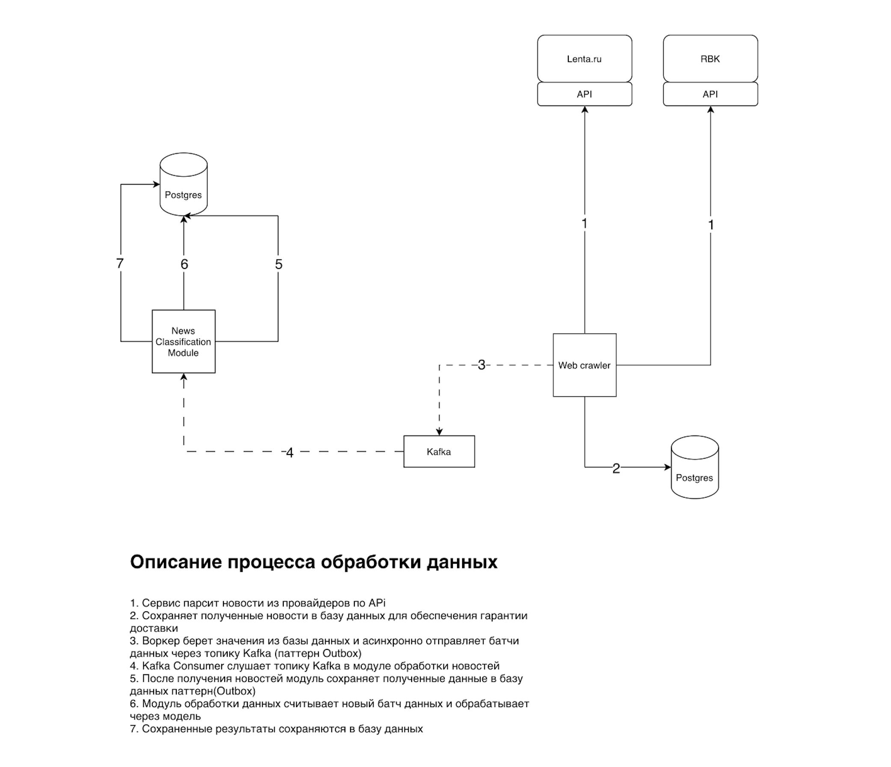

# Индивидуальный проект 

## Тема проекта:
Разработка сервиса тематического моделирования новостного потока на русском языке.

## Цель проекта 
Разработать сервис, который позволяет автоматически выделять и анализировать темы в новостном потоке на русском языке.

## Задачи проекта
     1. Собрать и подготовить корпус русскоязычных новостей.
     2. Реализовать baseline-подход к тематическому моделированию.
     3. Сравнить несколько подходов к выделению тем.
     4. Развернуть инференс-сервис, который принимает текст новости и возвращает тему или наиболее близкий кластер.
     5. Подготовить решение к запуску в Docker-контейнерах.

## Проблема

Ручной анализ новостных потоков требует значительных временных и когнитивных затрат. При большом объёме поступающих новостей (десятки тысяч статей) становится практически невозможным быстро определить, к каким темам относятся публикации, какие события являются значимыми, а какие — второстепенными.

Кроме того, поток новостей:

	•	неструктурирован,
	•	постоянно обновляется,
	•	содержит дублирующуюся и шумовую информацию.

В результате:

	•	аналитики тратят много времени на классификацию новостей,
	•	сложно отслеживать развитие тем в реальном времени,
	•	невозможно эффективно обрабатывать большие массивы текстов вручную.

## Решение

Для решения данной проблемы предлагается разработать сервис тематического моделирования новостных данных на основе методов машинного обучения.

Сервис автоматически:

	•	анализирует тексты новостей,
	•	группирует их по темам,
	•	присваивает каждой статье тематический кластер,
	•	позволяет выявлять основные направления новостного потока.

В основе сервиса лежит модель на базе RuBERT, которая преобразует тексты в векторные представления, после чего применяется алгоритм кластеризации (например, KMeans) для выделения тематических групп.

Сервис может работать в режиме реального времени:

	•	принимать новые новости (например, через Kafka),
	•	автоматически определять их тему,
	•	сохранять результаты для дальнейшего анализа.

Выгода от внедрения сервиса

Для аналитиков и исследователей

	•	автоматическая структуризация новостного потока
	•	сокращение времени на ручную классификацию
	•	возможность быстро находить релевантные темы

Для разработчиков и data-команд

	•	готовый инструмент для работы с текстовыми потоками
	•	возможность интеграции в аналитические системы
	•	ускорение разработки продуктов, связанных с обработкой текста

Для бизнеса

	•	снижение затрат на обработку информации
	•	повышение скорости принятия решений
	•	возможность мониторинга информационного фона в реальном времени
	•	выявление трендов и ключевых событий

Необходимость и функция ML

Традиционные подходы на основе правил и ключевых слов имеют ряд ограничений:

	•	не учитывают контекст,
	•	плохо работают с синонимами и сложными формулировками,
	•	требуют ручной настройки и поддержки.

Машинное обучение позволяет:

	•	учитывать семантику текста,
	•	выявлять скрытые связи между словами и документами,
	•	автоматически группировать тексты по смыслу без разметки (unsupervised).

Модель принимает на вход текст новости, преобразует его в embedding с помощью RuBERT и определяет принадлежность к тематическому кластеру.

Это позволяет:

	•	масштабировать анализ на большие объемы данных,
	•	работать в реальном времени,
	•	получать более качественную и устойчивую кластеризацию по сравнению с rule-based подходами.

## Бизнес-метрики, которые могут улучшиться после внедрения сервиса тематического моделирования новостей

Внедрение сервиса тематического моделирования новостного потока позволяет улучшить не только технические метрики качества модели, но и прикладные бизнес-метрики, отражающие реальную пользу системы для аналитиков, редакторов и бизнеса.

### 1. Среднее время обработки одной новости
Показывает, сколько времени требуется системе или сотруднику, чтобы определить тему новости и включить её в дальнейший анализ.

Формула:
Среднее время обработки = суммарное время обработки всех новостей / количество обработанных новостей

Ожидаемый эффект:
После внедрения сервиса это время снижается за счёт автоматического присвоения темы без участия человека.

### 2. Доля новостей, обработанных автоматически
Показывает, какая часть входящего новостного потока проходит тематическую классификацию без ручной обработки.

Формула:
Доля автоматически обработанных новостей = количество автоматически классифицированных новостей / общее количество новостей * 100%

Ожидаемый эффект:
Метрика растёт, так как система берёт на себя значительную часть рутинной работы.

### 3. Сокращение трудозатрат аналитиков
Показывает, насколько уменьшается объём ручной работы по группировке и просмотру новостей.

Примеры измерения:
- количество человеко-часов в день на ручную классификацию;
- количество новостей, которые аналитик обрабатывает вручную за смену;
- доля ручной работы в общем процессе анализа.

Ожидаемый эффект:
После внедрения сервиса трудозатраты снижаются, а аналитики могут сосредоточиться на интерпретации и принятии решений.

### 4. Скорость обнаружения новых тем и инфоповодов
Показывает, насколько быстро система позволяет заметить появление новой темы или всплеска публикаций по определённому сюжету.

Формула:
Время обнаружения темы = время появления публикаций в потоке - время фиксации темы в системе

Ожидаемый эффект:
Метрика снижается, поскольку сервис работает в близком к реальному времени и позволяет быстрее выявлять тренды и значимые события.

### 5. Время подготовки аналитической сводки
Показывает, сколько времени требуется на сбор новостей по темам и формирование обзора для руководителя, редактора или аналитического отдела.

Ожидаемый эффект:
Снижается за счёт автоматической тематической группировки и готовой структуры потока.

## Подготовка данных

Перед обучением модели проводится этап предобработки текстовых данных.

Основные этапы подготовки данных:

    1. Очистка текста:
    - удаление HTML-тегов и служебных символов;
    - удаление лишних пробелов;
    - приведение текста к нижнему регистру.

    2. Фильтрация данных:
    - удаление пустых записей;
    - удаление слишком коротких текстов.

    3. Удаление стоп-слов:
    - исключение часто встречающихся слов, не несущих смысловой нагрузки (например: "и", "в", "на").

    4. Нормализация текста:
    - приведение слов к базовой форме (лемматизация) или использование токенизации.

    5. Удаление дубликатов:
    - исключение повторяющихся или почти идентичных новостей.

## Анализ данных

На этапе первичного анализа данных (EDA) проводится исследование характеристик датасета.

В рамках анализа планируется:
    - определить общее количество новостей;
    - проанализировать распределение длины текстов;
    - выявить количество пустых и коротких записей;
    - оценить разнообразие источников данных;
    - провести частотный анализ слов;
    - при наличии категорий — проанализировать их распределение.

Цель анализа — выявить особенности данных, возможные перекосы и шум, а также определить необходимость дополнительной очистки и балансировки.

Результаты анализа используются для выбора методов предобработки и настройки модели.

### График распределения длины текстов
Для визуализации распределения длины текстов используется гистограмма, которая показывает, как
распределяются тексты по количеству слов. Это позволяет выявить наличие аномально коротких или длинных текстов, которые могут влиять на качество модели.

### График распределения данных по годам
Гистограмма, отображающая количество новостей по годам, позволяет оценить временное распределение данных. Это важно для понимания актуальности и разнообразия тем, а также для выявления возможных перекосов в данных (например, если большая часть новостей приходится на определённый период).

## Предварительный стек технологий и их обоснование
Вот таблица под твой проект — с учетом того, что у тебя Kafka + RuBERT + кластеризация + batch worker 👇

Предварительный выбор технологий и их обоснование

## Предварительный выбор технологий и их обоснование

| Модуль | Технология | Обоснование | Альтернатива | Отклонено |
|--------|-----------|------------|-------------|-----------|
| Backend API | FastAPI | Асинхронность, высокая производительность, автоматическая документация (OpenAPI), удобная интеграция с ML | Flask, Django | Flask — слабая поддержка async. Django — избыточен и тяжел для микросервиса |
| Обработка очередей | Kafka | Высокая пропускная способность, надежность, подходит для потоковой обработки новостей | RabbitMQ, Celery + Redis | RabbitMQ — хуже масштабируется под поток данных. Celery — не подходит для streaming-сценариев |
| ML-инференс | PyTorch + Transformers | Готовые модели (RuBERT), гибкость, интеграция с HuggingFace | TensorFlow, ONNX Runtime | TensorFlow — сложнее в использовании. ONNX — усложняет пайплайн на старте |
| Кластеризация | scikit-learn (KMeans) | Простота, быстрый inference, подходит для online-классификации | HDBSCAN, DBSCAN | HDBSCAN — медленный и плохо подходит для realtime |
| Обработка текста | pymorphy3 | Качественная лемматизация русского языка | Natasha, spaCy | Natasha — слабее для лемматизации. spaCy — хуже поддержка русского |
| Хранение данных | PostgreSQL | Надежность, ACID, удобная работа с JSON и аналитикой | MongoDB, ClickHouse | MongoDB — слабая консистентность. ClickHouse — избыточен на старте |
| Оркестрация | Docker Compose | Простота развертывания, изоляция сервисов | Kubernetes | Kubernetes — избыточен для текущего масштаба |
| Batch обработка | Python worker (custom) | Гибкость, полный контроль над логикой инференса | Celery | Celery — лишняя сложность при наличии Kafka |
| EDA / аналитика | Pandas + Matplotlib | Простота, достаточность для анализа данных | Plotly, Seaborn | Plotly — избыточен. Seaborn — не дает значительных преимуществ |
| Конфигурация | pydantic / env-based config | Валидация конфигурации, удобство работы с переменными окружения | dotenv-only | dotenv без валидации — риск ошибок |

# Лабораторная работа 2. Разработка архитектуры системы и стратегии валидации модели

## Пайплайн обработки данных и обучения модели

Процесс обработки данных и обучения модели включает следующие этапы:

    1. Получение текстов новостей из источника данных.
    2. Предобработка текста (очистка, нормализация, удаление стоп-слов).
    3. Преобразование текстов в числовое представление с использованием эмбеддингов предобученной языковой модели.
    4. Кластеризация текстов:
    - применение алгоритмов кластеризации (KMeans, HDBSCAN).
    5. Выделение тем:
    - определение ключевых слов для каждого кластера;
    - интерпретация кластеров как тематик.
    6. Оценка качества модели с использованием выбранных метрик.

## Cбор данных
Для обучения датасета будет использован два датасета:  [датасет русских новостей 20 года](https://www.kaggle.com/datasets/vfomenko/russian-news-2020) и  [датасет русских новостей с 15 по 20 год](https://huggingface.co/datasets/IlyaGusev/ru_news) с kaggle.com 
Для запуска системы, данные будут парситься в real-time с различных площадок: Lenta.ru, Izvestia и тд. 

## Архитектура проекта 
P.S. добавить изображение

## Метрики 
Так как задача тематического моделирования не всегда имеет строгую разметку, метрики выбираются комбинированно.
### Основные метрики
### Topic Coherence
Показывает, насколько слова внутри одной темы логически связаны между собой.
### Silhouette Score
Оценивает, насколько хорошо документы разделены по кластерам.
### Topic Diversity
Показывает, насколько темы отличаются друг от друга, а не повторяют один и тот же набор слов.

## Обоснование архитектурных решений

В архитектуре системы используется асинхронный подход к обработке данных.

Компонент Kafka применяется для организации потоковой передачи данных между сервисами. Это позволяет:

    - обрабатывать новости в реальном времени;
    - масштабировать систему при увеличении нагрузки;
    - обеспечить устойчивость к сбоям за счёт буферизации сообщений.

Использование базы данных позволяет сохранять как исходные новости, так и результаты обработки, что обеспечивает воспроизводимость и возможность последующего анализа.

Использование паттерна Outbox обусловлено обеспечения гарантии доставки и потребленния сообщений без потери данных. 

Каждая часть модулей, предполагает паттерн Воркер, которая легко масштабируется путем добавления их количества.

## Стратегия валидации модели

В рамках проекта решается задача тематического моделирования новостного потока, относящаяся к задачам обучения без учителя. 
В связи с отсутствием размеченной выборки классические методы валидации (train/test split с оценкой accuracy) неприменимы.

Для оценки качества модели используется комбинированный подход, включающий внутренние метрики кластеризации и качественный анализ результатов.

## Внутренние метрики кластеризации

Для оценки качества кластеризации используются следующие метрики:

- Silhouette Score:
  оценивает степень разделимости кластеров и компактность внутри кластеров;

- Topic Coherence:
  показывает, насколько слова внутри темы логически связаны между собой;

- Topic Diversity:
  оценивает различие между темами и предотвращает их дублирование.

## Сравнение моделей

Проводится сравнение нескольких подходов:
- TF-IDF + KMeans (baseline);
- эмбеддинги + кластеризация;
- BERTopic (при необходимости).

Сравнение осуществляется по выбранным метрикам.

## Ручная оценка

Для ряда кластеров проводится экспертная оценка:
- анализируются тексты внутри кластера;
- проверяется логичность выделенной темы;
- оценивается интерпретируемость результатов.

## Проверка стабильности

Для оценки устойчивости модели проводится анализ стабильности результатов:
- обучение модели при разных значениях random seed;
- анализ изменения кластеров;
- оценка устойчивости выделяемых тем.

## Возможные источники утечек:

1. Использование всей выборки при построении признаков
Например, построение TF-IDF словаря на всех данных, включая тестовые.

2. Повторное использование данных
Одинаковые или дублирующиеся новости могут попадать в разные части выборки.

3. Использование будущих данных
При работе с временными данными возможно использование новостей из будущего при обучении модели.

## Для предотвращения утечек применяются следующие меры:

- разделение данных на обучающую и тестовую части;
- построение признаков (TF-IDF, эмбеддинги) только на обучающей выборке;
- удаление дубликатов до разбиения данных;
- при наличии временной информации — использование временного разделения (train на прошлом, test на будущем).

## Обеспечение воспроизводимости экспериментов

Для обеспечения повторяемости результатов реализуются следующие меры:

1. Фиксация случайности

- установка фиксированного значения random seed;
- контроль случайных операций в алгоритмах кластеризации.

2. Сохранение артефактов

- сохранение обученной модели;
- сохранение параметров модели;
- сохранение словарей и признаков.

3. Логирование экспериментов

- запись параметров обучения;
- фиксация значений метрик;
- сохранение результатов экспериментов.

4. Версионирование

- использование системы контроля версий (Git);
- фиксация зависимостей (requirements.txt);
- контроль версий данных (при необходимости).

## Требования к масштабированию

Система должна быть способна обрабатывать увеличивающийся поток новостей и масштабироваться при росте нагрузки.

1. Потоковая обработка

Использование брокера сообщений (Kafka) позволяет:
- обрабатывать данные асинхронно;
- распределять нагрузку между сервисами;
- обеспечивать устойчивость к сбоям.

2. Горизонтальное масштабирование

Модули обработки реализованы по принципу воркеров. 
Подобный паттерн позволяет горизонтально масштабировать систему путем добавления новых экземпляров воркера при увеличении нагрузки.

3. Разделение сервисов

Система разбита на независимые компоненты:
- сбор данных;
- обработка;
- инференс.

## Анализ метрик

Для оценки качества тематической кластеризации были рассмотрены несколько подходов: TF-IDF + KMeans, RuBERT + HDBSCAN, RuBERT + KMeans, а также RuBERT + KMeans с предварительно рассчитанными эмбеддингами и понижением размерности методом PCA.

### Сводная таблица результатов

| Модель | Метод | Параметры | Кол-во объектов | Кол-во кластеров | Silhouette | Coherence | Diversity | Noise |
|--------|-------|-----------|----------------:|-----------------:|-----------:|-----------:|-----------:|------:|
| tfidf_kmeans_baseline | KMeans | n_clusters=8, n_features=20000 | 21 673 | 8 | 0.0046 | 0.7394 | 0.8500 | — |
| tfidf_kmeans_baseline | KMeans | n_clusters=8, n_features=20000 | 21 673 | 8 | 0.0047 | 0.6769 | 0.7750 | — |
| rubert_clustering | HDBSCAN | pooling=cls, min_cluster_size=5, min_samples=15 | 21 673 | 2 | 0.2881 | 0.5650 | 1.0000 | 0.8102 |
| rubert_clustering | KMeans | pooling=mean, n_clusters_requested=8 | 21 673 | 8 | 0.0482 | 0.5152 | 0.6125 | 0.0000 |
| rubert_clustering | KMeans | pooling=mean, n_clusters_requested=6 | 21 673 | 6 | 0.0463 | 0.4780 | 0.5833 | 0.0000 |
| rubert_clustering_from_embeddings | KMeans + PCA | pooling=mean, n_clusters_requested=6, pca=50 | 292 019 | 6 | 0.0357 | 0.5432 | 0.6500 | 0.0000 |

### Общий анализ результатов

Полученные результаты показывают, что разные методы кластеризации обладают разными сильными и слабыми сторонами.

Наилучшие значения метрики coherence были получены у baseline-подхода TF-IDF + KMeans. В двух экспериментах coherence составила 0.7394 и 0.6769. Это говорит о высокой согласованности ключевых слов внутри тем и хорошей интерпретируемости кластеров. Иными словами, выделенные темы удобно анализировать содержательно, поскольку их словарное наполнение выглядит логичным и устойчивым.

Однако у TF-IDF + KMeans практически нулевые значения silhouette — 0.0046 и 0.0047. Это означает, что сами документы разделяются в пространстве признаков очень слабо. Следовательно, метод хорошо формирует интерпретируемые наборы слов, но хуже справляется именно с задачей качественного разделения документов на тематически обособленные группы.

Наилучшее значение silhouette показал подход RuBERT + HDBSCAN — 0.2881. Это существенно выше результатов остальных моделей и указывает на более чёткое разделение объектов в векторном пространстве. Кроме того, diversity равна 1.0, что говорит о максимальном различии тем по топ-словам. Тем не менее данный результат сопровождается очень высокой долей шума: noise_fraction составляет 0.8102, то есть более 81% документов не были отнесены ни к одному кластеру. Также модель выделила только 2 кластера. Это существенно ограничивает практическую применимость метода для полной тематической разметки новостного корпуса.

Модели RuBERT + KMeans показали более сбалансированные результаты. При числе кластеров 8 silhouette составила 0.0482, coherence — 0.5152, diversity — 0.6125. При числе кластеров 6 silhouette составила 0.0463, coherence — 0.4780, diversity — 0.5833. Эти результаты уступают TF-IDF по coherence, но превосходят его по silhouette. Это означает, что эмбеддинги RuBERT лучше отражают семантическую близость документов, однако итоговые темы оказываются менее интерпретируемыми с точки зрения набора ключевых слов. При этом доля шума равна нулю, а значит, все документы распределяются по кластерам.

Отдельного внимания заслуживает модель rubert_clustering_from_embeddings, применённая к существенно большему корпусу объёмом 292 019 документов. Для неё были получены следующие значения: silhouette — 0.0357, coherence — 0.5432, diversity — 0.6500. Несмотря на то что значение silhouette остаётся относительно невысоким, coherence выше, чем у RuBERT + KMeans на малом наборе данных. Это позволяет сделать вывод, что подход с предвычисленными эмбеддингами и PCA сохраняет приемлемое качество даже при масштабировании на крупный корпус.

### Интерпретация по моделям

#### TF-IDF + KMeans
Преимуществами данной модели являются высокая coherence и высокая diversity. Это делает её удобной для интерпретации тем и использования в качестве базового эталона для сравнения. Недостатками являются почти нулевой silhouette и слабая семантическая разделимость документов. Таким образом, TF-IDF + KMeans следует рассматривать прежде всего как baseline-модель, хорошо подходящую для демонстрации интерпретируемости тем, но не как оптимальное решение для качественной кластеризации документов.

#### RuBERT + HDBSCAN
Основным преимуществом данной модели является лучший silhouette среди всех протестированных вариантов. Кроме того, diversity равна 1.0, что указывает на высокую различимость найденных тематических ядер. Недостатки модели заключаются в крайне высокой доле шума и очень малом числе найденных кластеров. Следовательно, RuBERT + HDBSCAN можно рассматривать как экспериментальный инструмент для выделения наиболее плотных тематических ядер, но не как основной метод для полной кластеризации новостей.

#### RuBERT + KMeans
Эта группа моделей демонстрирует наиболее сбалансированные результаты. Их преимуществами являются нулевая доля шума, полное покрытие корпуса и более выраженная семантическая кластеризация по сравнению с TF-IDF. Среди недостатков можно отметить более низкие значения coherence и diversity по сравнению с baseline-подходом. В целом RuBERT + KMeans можно считать практическим компромиссом между интерпретируемостью тем и качеством распределения документов по кластерам.

#### RuBERT from embeddings + PCA
Данный подход показал, что использование заранее рассчитанных эмбеддингов и снижения размерности позволяет эффективно работать с крупным массивом данных. Его преимуществами являются масштабируемость, приемлемая coherence и полное распределение документов по кластерам. Недостатком остаётся относительно низкое значение silhouette. Тем не менее именно этот вариант выглядит наиболее перспективным для построения рабочей системы на реальном новостном потоке.

### Ранжирование моделей по метрикам

По метрике coherence результаты располагаются следующим образом:
1. TF-IDF baseline — 0.7394
2. TF-IDF baseline — 0.6769
3. RuBERT + HDBSCAN — 0.5650
4. RuBERT from embeddings + PCA — 0.5432
5. RuBERT + KMeans (8 кластеров) — 0.5152
6. RuBERT + KMeans (6 кластеров) — 0.4780

По метрике silhouette результаты располагаются следующим образом:
1. RuBERT + HDBSCAN — 0.2881
2. RuBERT + KMeans (8 кластеров) — 0.0482
3. RuBERT + KMeans (6 кластеров) — 0.0463
4. RuBERT from embeddings + PCA — 0.0357
5. TF-IDF baseline — 0.0047
6. TF-IDF baseline — 0.0046

### Итоговый вывод

На основании проведённого анализа можно сделать вывод, что TF-IDF + KMeans обеспечивает наилучшую интерпретируемость тем, однако плохо разделяет документы в признаковом пространстве. RuBERT + HDBSCAN показывает наилучшее разделение кластеров по silhouette, но сопровождается слишком большой долей шума и потому не подходит для полной кластеризации корпуса. Наиболее сбалансированным вариантом является RuBERT + KMeans, который обеспечивает полное покрытие корпуса и приемлемое качество кластеризации. В то же время наиболее перспективным для дальнейшего развития рабочей системы является подход RuBERT with embeddings + PCA, поскольку он демонстрирует устойчивое качество при масштабировании на большой объём данных.

### Практическое решение для текущей работы

В рамках текущей работы целесообразно использовать:
- TF-IDF + KMeans как baseline-модель для сравнения;
- RuBERT + KMeans как основной рабочий вариант кластеризации;
- RuBERT + HDBSCAN как экспериментальный подход для поиска наиболее плотных тематических групп.

Таким образом, основным направлением дальнейшей работы следует считать развитие решений на основе эмбеддингов RuBERT, поскольку именно они обеспечивают лучший баланс между качеством кластеризации, полнотой покрытия корпуса и возможностью масштабирования.